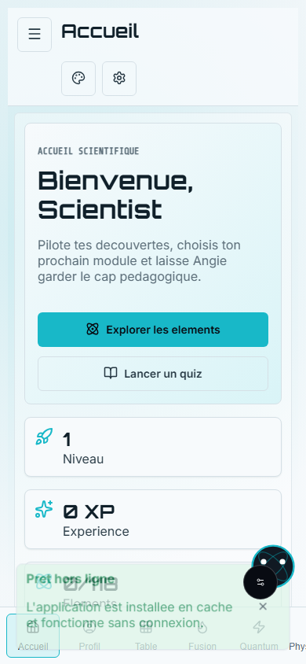
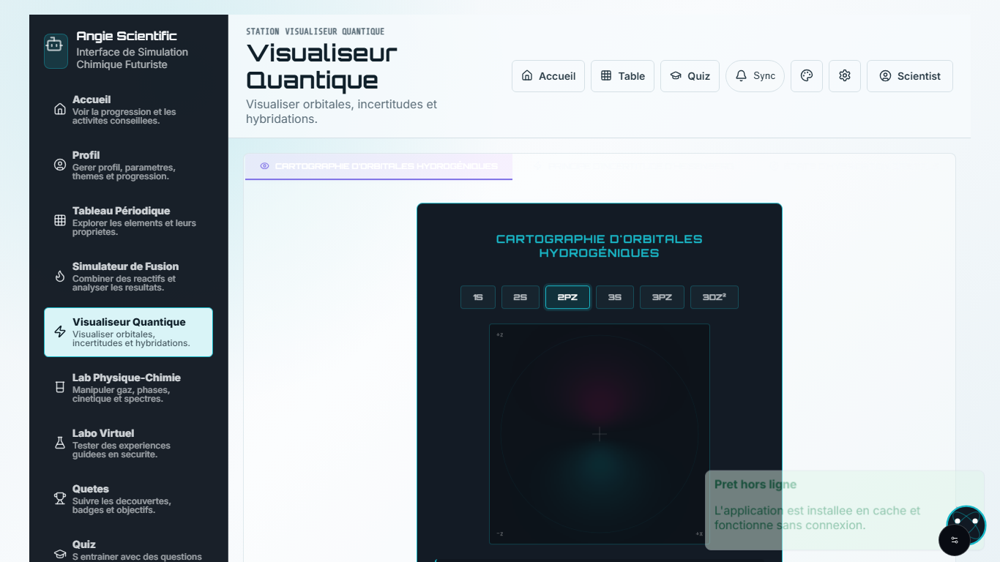
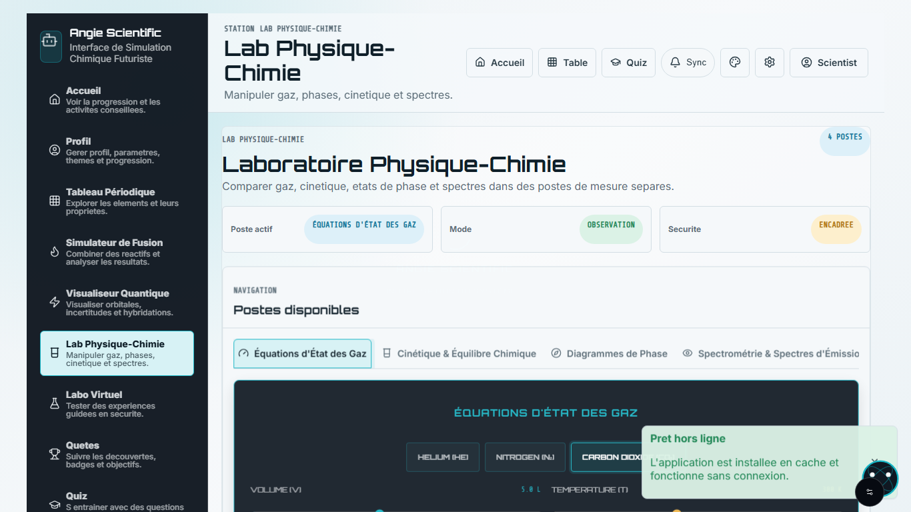
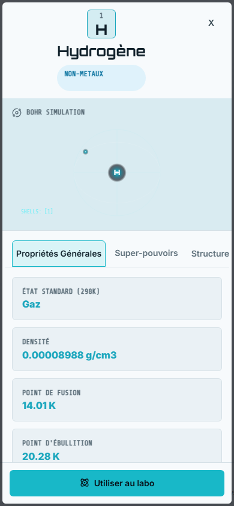
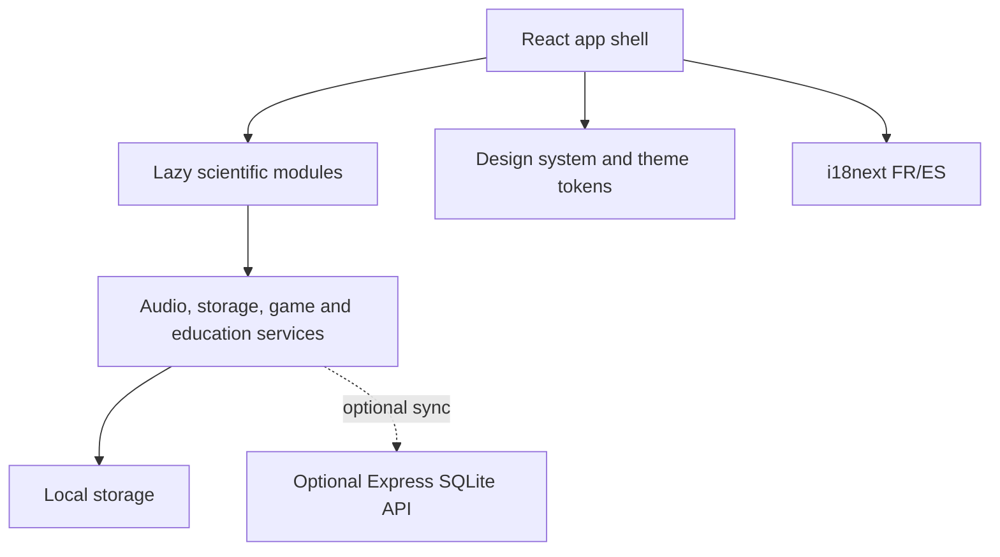

# Angie Scientific

Interactive bilingual science learning app for chemistry, physics and quantum
visualization.

Angie Scientific is a React application for exploring scientific concepts
through visual modules instead of static encyclopedia pages. It combines a
periodic table, reaction and fusion simulations, quantum visualizations,
physics-chemistry laboratories, quizzes, user progress and a local Angie mascot
experience.


Status: active refactor branch. Last local validation in this branch ran lint,
type-check, Vitest, production build, Playwright E2E and npm audit on
2026-07-14.

## Contents

- [Screenshots](#screenshots)
- [Features](#features)
- [Angie Mascot](#angie-mascot)
- [Themes](#themes)
- [Internationalization](#internationalization)
- [Architecture](#architecture)
- [Tech Stack](#tech-stack)
- [Installation](#installation)
- [Configuration](#configuration)
- [Scripts](#scripts)
- [Quality](#quality)
- [Project Structure](#project-structure)
- [Roadmap](#roadmap)
- [Security](#security)
- [Contribution](#contribution)
- [License](#license)

## Screenshots

| Dashboard | Quantum visualizer |
| --- | --- |
|  |  |

| Physics-chemistry lab | Element detail |
| --- | --- |
|  |  |

## Features

- Interactive periodic table with element tiles, search, filtering, favorites,
  comparison and an element detail modal.
- Lewis, VSEPR and atomic visualizations rendered with canvas helpers.
- Fusion and reaction simulator with equation rendering, telemetry,
  stoichiometry and energy diagrams.
- Quantum visualizer with orbital controls, hybridization, comparison panels
  and a Heisenberg experiment.
- Physics-chemistry lab stations for gas equations, kinetics and equilibrium,
  phase diagrams and spectroscopy.
- Virtual lab with canvas-based experiments, parameter controls and accessible
  status updates.
- Quiz, riddles, quests, badges, discovery album and local progress tracking.
- User center for profile, preferences, progress, album and theme choices.
- Responsive app shell with keyboard navigation, skip link and error
  boundaries around the main scientific modules.
- PWA registration with auto-update prompt and a GitHub Pages base path.

Experimental or optional parts:

- The `server/` package is a small local Express and SQLite API for profiles
  and progress. The production frontend is currently able to fall back to local
  storage and does not require this server to run.

## Angie Mascot

Angie is implemented as a local mascot component and context provider. It can
show contextual messages, react to user actions and play notification sounds
when user preferences allow it.

Current limits:

- Angie messages are local application strings and service responses.
- No remote AI service is configured in this repository.
- Sound, mascot visibility and reduced-motion behavior are controlled through
  the user profile preferences.

## Themes

The app ships with these theme IDs:

- `system`
- `light`
- `dark`
- `scientific-night`
- `laboratory`
- `high-contrast`

Themes are provided through `ThemeProvider`, CSS theme files and design tokens
under `src/theme` and `src/styles`. The selected theme is persisted with the
`angie-scientific-theme` storage key. The system theme follows the browser color
scheme preference.

## Internationalization

The app uses i18next and react-i18next. French is the fallback language and
Spanish is also supported.

Translation files live in:

```text
src/locales/fr/
src/locales/es/
```

Namespaces currently include `common`, `navigation`, `auth`, `settings`,
`periodicTable`, `quantum` and `fusion`. The language detector checks local
storage and the browser language, then stores the choice in local storage.

## Architecture



## Tech Stack

- React 19 for the UI.
- TypeScript 6 for static typing in the frontend.
- Vite 8 for development and production build.
- vite-plugin-pwa for PWA registration and assets.
- i18next and react-i18next for FR/ES localization.
- lucide-react for interface icons.
- Vitest and React Testing Library for unit and component tests.
- Playwright for end-to-end tests.
- oxlint for linting.
- Optional local backend: Express 5, SQLite and TypeScript in `server/`.

## Installation

Prerequisites:

- Node.js 20 or newer is recommended. GitHub Actions uses Node.js 20.
- npm, from the Node.js installation.

```bash
git clone https://github.com/Kuroi1998/angie-scientific.git
cd angie-scientific
npm install
npm run dev
```

Vite opens the app on `http://localhost:5173/` by default.

Optional local backend:

```bash
cd server
npm install
npm run dev
```

The backend listens on `http://localhost:3001` by default.

## Configuration

No secret is required to run the frontend. See `.env.example` for optional local
ports. Do not commit real `.env` files.

The production frontend build uses this base path:

```text
/angie-scientific/
```

## Scripts

| Command | Purpose |
| --- | --- |
| `npm run dev` | Start Vite with HMR. |
| `npm run build` | Run TypeScript build and create the production bundle. |
| `npm run preview` | Preview the production bundle locally. |
| `npm run lint` | Run oxlint. |
| `npm run typecheck` | Run TypeScript without emitting files. |
| `npm run test` | Run Vitest once. |
| `npm run test:watch` | Run Vitest in watch mode. |
| `npm run test:e2e` | Run Playwright end-to-end tests. |

## Quality

Validated locally in this branch on 2026-07-14:

- `npm audit --audit-level=moderate`: 0 vulnerabilities.
- `npm run lint`: passed.
- `npm run typecheck`: passed.
- `npm run test`: 127 tests passed.
- `npm run build`: passed.
- `npm run test:e2e`: 14 tests passed.

No coverage percentage is published because no coverage report is generated by
the current scripts.

## Project Structure

```text
src/
  app/                 App routing and lazy module loading
  components/          Shared UI and scientific components
  design-system/       Buttons, forms, data, overlays and surfaces
  engines/             Chemistry, bonding and quantum helpers
  features/            Quantum and physics-chemistry feature modules
  hooks/               Language, storage and tutorial hooks
  layout/              App shell and responsive navigation
  locales/             French and Spanish i18n namespaces
  pages/               Dashboard and page-level content
  services/            Audio, storage, game, education and visuals
  styles/              Global tokens, foundation and responsive CSS
  theme/               Theme provider, storage and theme CSS
  utils/               Canvas, CSS, formula and notification utilities
```

## Roadmap

- [x] React and TypeScript frontend.
- [x] Periodic table, element detail and scientific visualizations.
- [x] FR/ES localization.
- [x] Light, dark, system, high-contrast and laboratory themes.
- [x] Local profile and progress persistence.
- [x] Unit, component and E2E test suites.
- [ ] Decide whether the optional backend remains part of production scope.
- [ ] Add generated coverage reporting if the project needs coverage badges.
- [ ] Continue expanding physics-chemistry simulations.

## Security

- Never commit `.env`, database files, private keys or local logs.
- Use `.env.example` for non-sensitive configuration examples.
- Run `npm audit --audit-level=moderate` before releases.
- See `SECURITY.md` for responsible vulnerability reporting.

## Contribution

See `CONTRIBUTING.md`.

Important project rules:

- Keep manually maintained source files at or below 300 lines.
- Add or update tests for behavior changes.
- Keep FR and ES translations in sync for user-facing text.
- Verify both light and dark themes for visible UI changes.
- Update documentation when adding or changing public features.

## License

MIT. See `LICENSE`.
