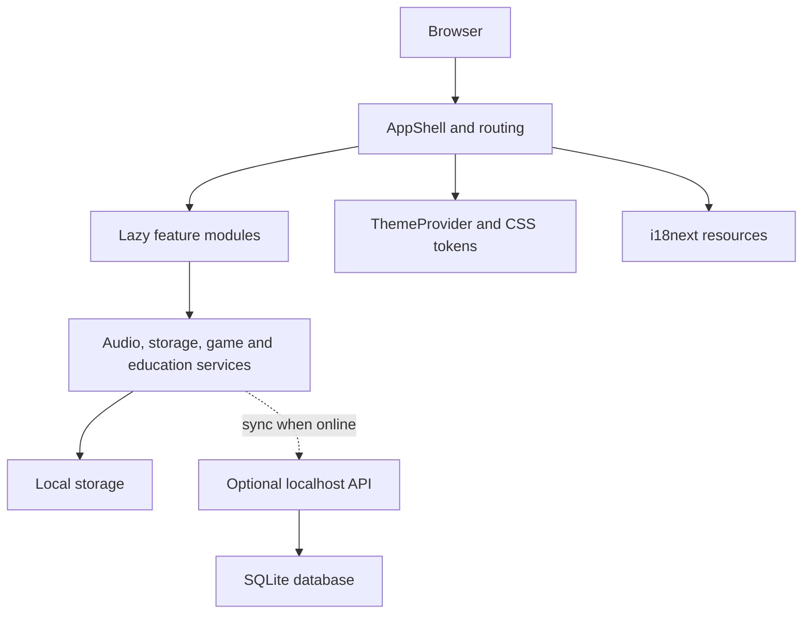

# Architecture

Angie Scientific is primarily a frontend React application. A small optional
Express and SQLite backend exists under `server/`, but the current frontend can
work through local storage fallback and does not require a deployed backend.

## Runtime Layers

## Frontend Entry Points

- `src/main.tsx` imports global tokens, theme CSS and initializes React.
- `src/i18n.ts` configures i18next resources and language detection.
- `src/App.tsx` wires login, user progress, mascot, app shell and lazy modules.
- `src/app/ActiveModule.tsx` maps route IDs to scientific modules.

## Feature Areas

- `src/components/PeriodicTable` contains the table layout, controls, tiles and
  element side panel.
- `src/components/ElementCard` contains detail modal, Lewis and VSEPR helpers.
- `src/components/ReactionSimulator` contains fusion, stoichiometry and energy
  diagram UI.
- `src/features/quantum-visualizer` contains quantum-specific modules.
- `src/features/physics-chemistry-lab` contains gas, kinetics, phase and
  spectroscopy stations.
- `src/components/VirtualLab` contains virtual lab experiments.
- `src/components/UserCenter` contains profile, progress, album and theme UI.

## Shared Systems

- Design system components live in `src/design-system`.
- Theme IDs, storage and CSS files live in `src/theme`.
- Translation resources live in `src/locales/fr` and `src/locales/es`.
- Reusable scientific engines live in `src/engines`.
- Storage, audio, game and education services live in `src/services`.

## Optional Backend

The backend exposes profile and progress routes under `/api`. It stores data in
a local SQLite database generated under `database/`. This generated database is
ignored by Git.
